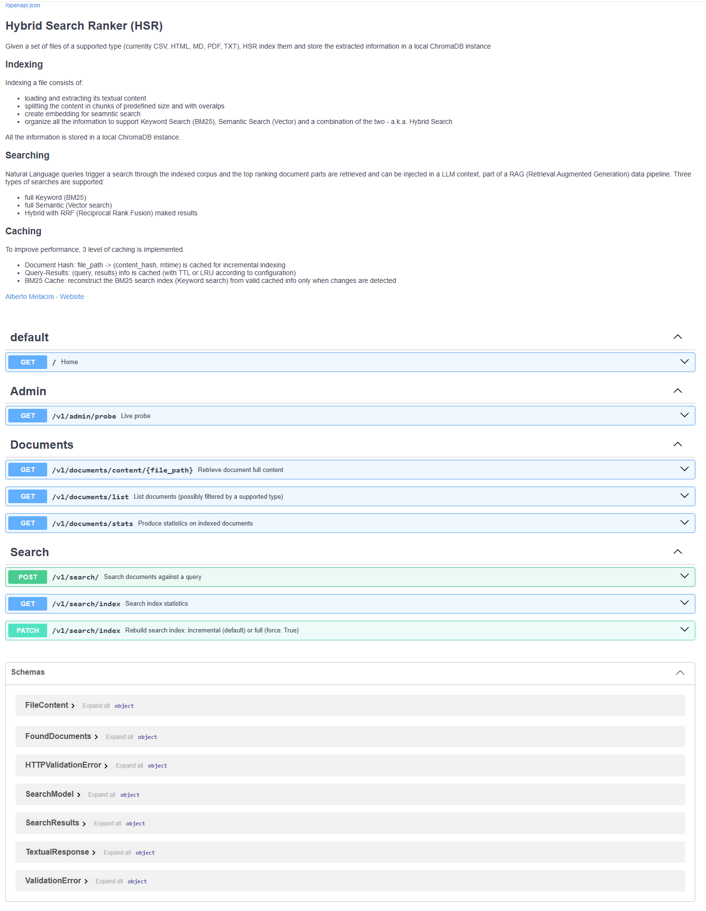
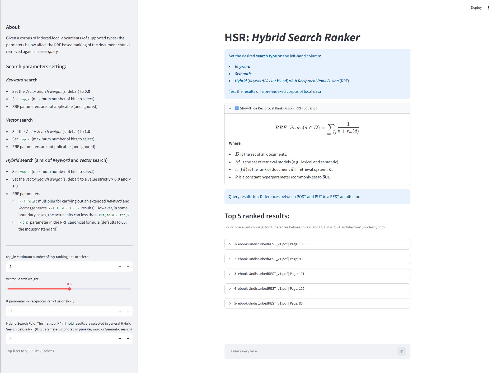

# HSR: _Hybrid Search Ranker_ - a RAG Pipeline Validation Tool

**Table of Contents**
- [What is RAG?](#what-is-rag)
    * [How is the specific information identified?](#how-is-the-specific-information-identified)
- [What is HSR?](#what-is-hsr)
    * [HSR Caching System](#hsr-caching-system)
    * [Reciprocal Rank Fusion (RRF)](#reciprocal-rank-fusion-rrf)
    * [RRF engineering practice beyond the academic reference](#rrf-engineering-practice-beyond-the-academic-reference)
- [HSR Download and Setup](#hsr-download-and-setup)
    * [Configuration](#configuration)
    * [Automated setup (requires `docker compose`)](#automated-setup-requires-docker-compose)
    * [Manual setup (development scenario)](#manual-setup-development-scenario)
- [Future Work](#future-work)
    * [Functional Enhancements](#functional-enhancements)
    * [Non-functional Enhancements](#non-functional-enhancements)


RAG (_Retrieval Augmented Generation_) plays a central role in modern LLM[^1] based AI applications.

_Hybrid Search Ranker_ (HSR from now on) helps in the QA of the RAG component of an AI application, _independently and before_ an LLM query is triggered (e.g. via a chatbot).

This work has been heavily inspired by *_"LLM System Design Architecture: Building Production AI Applications"_* [(_follow link_)](https://infrasketch.net/blog/llm-system-design-architecture) - a _must-read_ for any beginner AI practitioner in the Software Engineering community.  
This is an excerpt from the article takeaways:
>  _Do not over-engineer your data layer before you have validated your RAG pipeline's retrieval quality._


## What is RAG?
Pre-trained LLMs - _a.k.a. Base Models_ - are generic and unlikely to contain knowledge specific to someone needs (especially if this knowledge is private and confidential).

_Fine-Tuning_ a Base Model (_i.e_ training it on a specific, proprietary body of knowledge) still requires considerable efforts and repeating the operation every time there is a change in the knowledge would be totally infeasible.

The idea is to _inject_ any specific knowledge in the _Context Window_ that complements the _Prompt_ when the LLM is invoked.  However, the Context Window has only a limited size and the information that gets injected must be **judiciously** selected.

### How is the specific information identified?
Without any loss of generality, let's consider the proprietary knowledge - _a.k.a. Corpus_ - mostly in textual form and retrieved from files, databases, web sites etc... The Corpus undergoes this processing:

1. the whole Corpus is scanned and broken down into smaller units - _a.k.a. "**chunks**"_
2. an alternative, vectorial[^2] representation is created for each chunk - _a.k.a. "**embedding**"_
3. _chunks, embeddings_ and _metadata_ are then stored into a _"**Vector Database**"_


The steps described above are often referred to as _"**Indexing**"_.

When the user enters a natural language _query_ for the LLM, that query is used to retrieve "_the most relevant set of chunks_" from the Vector Database and inject it in the Context Window that accompanies the Prompt when querying the LLM.

#### How is "_the most relevant set of chunks_" determined?
The user query triggers a _search_ through the indexed Corpus. Several types of search are possible, let's focus on three.

##### Keyword Search
The textual representation of the user query is used to identify the relevant chunks. This type of search is typical in "web searches" and the technology behind formed in the '90s and early 2000s. Notably:

- TF (_Term Frequency_)[^3]: Tells how many times a search word shows up in a single file. More counts mean higher relevance.
- IDF (_Inverse Document Frequency_)[^3]: Tells if a word is rare or common in the whole database. Words like "the" get very low scores. Rare words get high scores.
- TF-IDF: Combines TF and IDF[^4]. It highlights words that are frequent in one specific document but rare everywhere else.
- BM25 (_Best Match 25_)[^5][^6]: A modern probabilistic text ranking function used by search tools like Elasticsearch and Lucene.

> **BM25** is what adopted by HSR for Keyword Searches


##### Semantic Search
Semantic search retrieves information based on meaning and context rather than exact keyword matches[^7] [^8] [^9].

An embedding is a vectorial representation of a textual (in this case) chunk created by a type of Language Model called "_Sentence Transformers_".  If the user query is transformed into embeddings using the same Sentence Transformer, the closeness "query/chunk" can be determined mathematically (via trigonometric and/or vectorial operations).
This search criterion would capture semantic affinities that go beyond the syntactic aspect.

##### Hybrid Search
It is a combination of Keyword- and Semantic- search.

According to the nature of the Corpus, one type of search may be more suitable than another.  When the Corpus consists of literature, newspaper articles and prose in general, semantic searches produce the best results.  However, in the case of highly structured information - _e.g._ developer's guide for an SDK[^9] - keyword searches tend to be more accurate.

More often than not, however, typical Corpora consist of an heterogeneous mix, hence the need to combine both techniques.


## What is HSR?
Within an AI application ecosystem, HSR focuses on the Search stage of the RAG data pipeline.  In a nutshell, this is what HSR does. After selecting a location on the local machine:

1. HSR scans for files of a supported type (currently: _Comma Separated Values, HTML, Markdown, pdf_ and _plain text_)
2. Indexing is performed and the extracted information is stored in a local Vector Database (_Chroma DB_)
3. A web based UI offers the AI software practitioner the possibility of:
    
    * entering a natural language query
    * select the desired type of search (_Keyword/Semantic/Hybrid_) and the related parameters
4. The retrieved chunks (and reference to their source) are ranked according to relevance and displayed in the UI

HSR uses BM25 indexing for keyword searches and performs a vector search across embeddings in ChromaDB (a vector database) for semantic searches

### HSR Caching System
In order to address performance both during indexing and while searching, HSR provides 3 level of caching.

#### Document Hash Cache for Incremental Indexing
A mapping `file_path: (content_hash, modified_time)` is maintained to avoid re-hashing when no modification is detected.

#### Search Results
User query, search parameters and ranked results are cached to avoid repeating the same search.  A configurable TTL (_Time To Live_) is used to expire the cached information (and avoid a persistent stale cache).
Redis is used if available, an LRU (_Least Recently Used_) in memory cache otherwise (by means of a Python `OrderedDict`).

#### BM25 Indexing (Keyword Search)
BM25 search information is serialized and cached to disk, together with a fingerprint of the whole Corpus (from _Document Hash Cache_).
At startup, if the fingerprint has not changed, BM25 data are read from disk - a faster operation than querying a database (_ChromaDB_).


### Reciprocal Rank Fusion (RRF)

One of the challenges of Hybrid Search is to combine the results of Keyword and Semantic searches in order to rank the search results.  
Instead of trying to somehow normalize arbitrary scores, RRF ignores the scores entirely and focuses on their rank within the search[^10].

The canonical formula (as it appeared in the original publication by Gordon Cormack & Co.[^11]) is:

$$RRF score(d \in D) = \sum_{r \in R} \frac{1}{k + r(d)}$$

**Where:**

- _D_ is the set of documents to be ranked
- _R_ is the set of input rankings
- _r(d)_ is the rank of document \(d\) in ranking _r_
- _k_ is a constant (which defaults to _60_)

### RRF engineering practice beyond the academic reference
In any type of search, the user enters a positive integer value (known as `top_k`) to receive the `top_k` best scoring search results.
The results from Hybrid Search are an ensemble of results from both Keyword and Semantic searches. 
In order not to lose resolution, both the Keyword and Semantic search are carried with an extended number of `top_k` results: `top_k * rrf_fold`.
`rrf_fold` is an arbitrary positive integer, not part of the original RRF formulation.

#### An in-depth on `rrf_fold`
The increase in the requested top scoring results (i.e. `top_k * rrf_fold`) is needed for RRF to have enough ranked evidence from each retrieval method.
Fetching only `top_k` from each source, RRF would have too few ranks to meaningfully fuse.

Although this “folding” technique is not part of the original RRF formula, it is a practical heuristic used in Information Retrieval systems like Elasticsearch, Vespa, OpenSearch, and other academic hybrid-search implementations.

##### A numerical example
Let's consider `top_k = 10`. Fetching 10 items from each ranker:

- Many relevant documents may appear at rank 20, 50, 100 in one system but not in the other.
- RRF cannot reward those documents because they never appear in the truncated lists.
- Fusion becomes shallow and biased towards whichever ranker has better early precision.

Fetching deeper lists (e.g. `top_k * rrf_fold = 10 * 3 = 30`) allows RRF to:

- detect documents that appear moderately high in both lists
- reward documents that appear high in one list but not the other
- reduce noise from early-ranking instability
- improve hybrid recall

This is especially important when combining semantic/vector search (high recall, fuzzy) with BM25 (high precision, lexical) - and BM25 is indeed HSR Keyword Search algorithm of choice!

HSR provides an interactive tool to fine-tune all the search parameters and decide upon the best configuration for the given Corpus (described later).

> **IMPORTANT**: 
> HSR operates on a local Corpus only and no information is copied/uploaded outside the local machine where HSR runs!

## HSR Download and Setup

HSR (a 100% Python codebase) can be fetched by performing:
```bash
$ cd <desired location>
$ git clone https://github.com/AMelacini/hybridsearch-ranker.git
$ cd hybridsearch-ranker
```
and it only requires a pre-installed recent version of Python (ideally 3.13).

After **Configuration** and in accordance with the intended use, HSR can be installed/setup in two ways:

1. Via _Docker_: it is mostly fully automated (no manual steps) but it requires that `docker compose` is available on the local host.
2. _Manually_:  by creating a Python virtual environment (via `uv`) and starting up services - recommended approach when the user intends to develop/debug the system.

### Configuration
HSR is configured via a set of envars defined in [`src/hsr_config.py`](src/hsr_config.py) and grouped by categories.
> Default values can be overridden by creating a `.env` file in the repo top directory (_see further sections for recommendations_).

#### Paths to data locations

| Variable          | Default          | Description                                |
| ----------------- | -----------------| ------------------------------------------ |
| `HSR_DOCS_DIR`    | `src/docs`       | Corpus top directory                       |
| `HSR_CACHE_DIR`   | `src/cache`      | Query/Results cache directory              |
| `HSR_CHROMA_DIR`  | `src/chroma_db`  | ChromaDB persistence directory             |

It is **strongly recommended** to provide custom values for the data location envars.

#### Database and Cache configuration
| Variable                 | Default                   | Description                                |
| ------------------------ | --------------------------| ------------------------------------------ |
| `HSR_QUERY_CACHE_TTL`    | `3600`                    | Query/Results cache TTL in seconds         |
| `HSR_REDIS_URL`          | `redis://localhost:6379`  | Redis connection URL (_optional_)          |
| `HSR_REDIS_ENABLED`      | `true`                    | Set to `false` to disable Redis entirely   |

Redis enables faster incremental re-indexing via content-hash caching. It is entirely optional: without Redis the server falls back to a local SQLite cache automatically.
If the Redis option is desired, ensure it is installed locally - for example via Docker: `docker run -name hsr-indexing -d -p 6379:6379 redis:latest`

#### Chunking, Embedding and Retrieval
| Variable                    | Default                                   | Description                              |
| ----------------------------| ------------------------------------------| -----------------------------------------|
| `HSR_CHUNK_SIZE`            | `1000`                                    | Target chunk size in characters          |
| `HSR_CHUNK_OVERLAP`         | `200`                                     | Overlap between chunks                   |
| `HSR_EMBEDDING_MODEL`       | `sentence-transformers/all-MiniLM-L6-v2`  | HuggingFace embedding model              |
| `HSR_EMBEDDING_MODEL_SIZE`  | `384`                                     | HuggingFace embedding model vector size  |
| `HSR_VECTOR_WEIGHT`         | `0.5`                                     | Weight for Hybrid Search                 |

There are no strict recommendations for the chunking parameters (_size, overlap_) - defaults come from literature but the nature of the Corpus may suggest different values.

HSR supports any of the HuggingFace _sentence-transformers_ library models ([_see official repository_](https://huggingface.co/models?pipeline_tag=feature-extraction)) - notably, all  _free-of-charge_.  Valid alternatives to the default model are:
<!-- cSpell:disable -->
- sentence-transformers/all-mpnet-base-v2 (Size: 768) – Higher accuracy, slightly slower.
- BAAI/bge-small-en-v1.5 (Size: 384) – Strong performance for retrieval tasks.
- BAAI/bge-large-en-v1.5 (Size: 1024) – Top-tier retrieval accuracy with higher resource usage.
- intfloat/e5-small-v2 (Size: 384) – Excellent general-purpose text embeddings.
- nomic-ai/nomic-embed-text-v1.5 (Size: 768) – Supports flexible dimensions and long contexts.
<!-- cSpell:enable -->

`HSR_VECTOR_WEIGHT` is purely a startup value that sets _Hybrid Search_ as the default search type. This value can be reset at each search invocation.

#### Frontend and Backend services
| Variable                      | Default | Description                         |
| ----------------------------- | --------| ------------------------------------|
| `HSR_UI_PORT`                 | `8501`  | UI: http://localhost:8501           |
| `HSR_REST_SERVER_PORT`        | `8000`  | REST server: http://localhost:8000  |
| `HSR_SEARCH_REQUEST_TIMEOUT`  | `180`   | Search request timeout (in seconds) |

HSR consists of two services:
- _frontend_: a _Streamlit_ web application - default http://localhost:8501/
- _backend_: a FastAPI REST server exposing endpoints for managing indexing and search results retrieval - default interactive documentation (_Swagger_) is available at http://localhost:8000/docs


### Automated setup (requires `docker compose`)
A Docker installation (with `docker compose`) is required.

Before invoking the Docker images creation and the containers instantiation it is fundamental to create a `.env` file with the desired configuration.

**IMPORTANT**: The backend container expects the Corpus to be available at the `/hsr/docs` mount point and the binding occurs by setting `HSR_HOST_DOCS_DIR` in the `.env` file.

Assuming a Windows local machine, a possible `.env` file could look like:
```bash
# Mandatory
HSR_HOST_DOCS_DIR=C:/Documents/my-corpus
HSR_DOCS_DIR=/hsr/docs

# Advisable
HSR_CHROMA_DIR=/hsr/indexer/chroma_db
HSR_CACHE_DIR=/hsr/indexer/cache

# If any of the default ports are already in use on the local machine (8000 and 8501)
# change default values accordingly:
# HSR_REST_SERVER_PORT=8001
# HSR_UI_PORT=8502
```

### Manual setup (development scenario)
Preliminary requirements:
- recent Python installation (ideally 3.13 or above)
- `uv` installation ([_see link_](https://docs.astral.sh/uv/getting-started/installation))

#### Python virtual environment (`venv`) creation
By default `uv` names the virtual environment `.venv` and places it in the repo top-directory.  If this is not desirable, initialize the following envars (Windows example):
```bash
set UV_PROJECT_ENVIRONMENT=C:/Document/hsr_venv
set VIRTUAL_ENV=%UV_PROJECT_ENVIRONMENT%
```

After changing directory to the repo top dir (_e.g._ `cd <local path>\hybridsearch-ranker`) create the venv with `uv sync` for a full development venv or `uv sync --no-dev` for a smaller footprint.

#### Environment setup
- extend PYTHONPATH to contain `<local path>\hybridsearch-ranker\src`
- create `.env` following this pattern:
```bash
# Mandatory
HSR_DOCS_DIR=C:/Documents/my-corpus

# Advisable
HSR_CHROMA_DIR=C:/Documents/hsr/indexer/chroma_db
HSR_CACHE_DIR=C:/Documents/hsr/indexer/cache

# If any of the default ports are already in use on the local machine (8000 and 8501)
# change default values accordingly:
# HSR_REST_SERVER_PORT=8001
# HSR_UI_PORT=8502
```

#### Redis via Docker (_optional_)
`$ docker run --name hsr_redis -d -p 6379:6379 redis:latest`

#### Startup backend
After setting up the environment as explained already, execute:
```bash
$ cd <local path>\hybridsearch-ranker
$ uv run python src\app\main.py
```
The first time around the full index is rebuilt - which can take a while according to the Corpus size.  Subsequent restarts will be considerably faster, as the index will be rebuilt incrementally (and only when changes are detected).

When a banner similar to:
```bash
[INFO] hsr-server: ════════════════════════════════════════════════════════════
[INFO] hsr-server: ✓ Hybrid Search Ranker backend is READY                     
[INFO] hsr-server:   Listening on http://0.0.0.0:8000                          
[INFO] hsr-server:   API docs: http://localhost:8000/docs                      
[INFO] hsr-server: ════════════════════════════════════════════════════════════
```
appears in the logger, the backend is ready to accept incoming requests.  To further test, visit http://localhost:8000/docs, expand the _Admin_ set of endpoints and execute the `GET /v1/admin/probe`: the response should be the local time and the user id.




Alternatively, `curl` can be used to exercise the endpoint:

```bash
$ curl -X 'GET' \
    'http://localhost:8000/v1/admin/probe' \
    -H 'accept: application/json'
```

#### Startup frontend
After setting up the environment as explained already, execute:
```bash
$ cd <local path>\hybridsearch-ranker
$ uv run streamlit run src/ui/main.py
```
The web UI is then available at http://localhost:8501/



##### Startup latency frontend/backend
When the backend starts up, the Indexing occurs and the time it takes is affected by:
- the Corpus size when the Index is first created
- the amount of detected changes at each subsequent startup

Until the Indexing completes, the backend is (technically) unavailable.

When the frontend starts up, it attempts a hand-shake with the backend at exponentially delayed intervals.  Currently 5 attempts for a total of 31 seconds.  If the backend service is still unavailable (which might well happen in cold starts) the hand-shake attempt stops and the user is invited to retry later by refreshing the browser (normally F5).

This form of timeout should not be confused with the _search execution timeout on the backend - which is fully configurable via the envar `HSR_SEARCH_REQUEST_TIMEOUT` (default 180 seconds).

## Future Work
HSR is mostly a learning platform and has no ambition to reach production standards. Nevertheless, the ecosystem is expected to grow and its quality improve.

Technical contributions are encouraged and enhancement suggestions welcome.

Please leave feedback in the **_Issues_** section associated to this GitHub repo or via [_LinkedIn_](https://www.linkedin.com/in/amelacini/)

### Functional Enhancements

#### 1) Chatbot
Develop a chatbot that connects the RAG system to a mainstream LLM.

#### 2) Extensibility
Create an extensibility framework where users can supply their own data format together with an associated ETL[^12] function. HSR should pick up the extra functionality without requiring code changes.

#### 3) Configurable backend hand-shake
Improve/make configurable the startup hand-shake from the frontend to the backend.

### Non-functional Enhancements

#### 1) Async REST client
The FastAPI based REST server at the heart of HSR backend is fully async.  However, the HSR frontend makes sync requests to the server when submitting a search query.
The plan is to replace the sync approach (based on the `requests` package) with an async client (using `httpx`, `aiohttp` or `niquest`)

#### 2) Pydantic guards along architectural boundaries
It is good software engineering practice to use Pydantic models at each sub-component boundary e.g. database, REST APIs, etc.
This already happens for the REST server entry points.  The approach should be extended to ChromaDB and the caching system.

#### 3) Improve testing
Tests (quality and coverage) ought to scale as HSR grows.


<!--
NOTE:
Markdown format does not have a standard for references. Each rendering engine handles them differently
-->

<!-- cSpell:disable -->
[^1]: LLM: _Large Language Model_

[^2]: A textual chunk is represented by a vector of real numbers - average vector length consists of approximately a few hundred values.

[^3]: Karen Spärck Jones (1972) – _A Statistical Interpretation of Term Specificity and Its Application in Retrieval_.

[^4]: Christopher D. Manning, Prabhakar Raghavan, Hinrich Schütze (2008) – _Introduction to Information Retrieval_,  Cambridge University Press.

[^5]: Stephen E. Robertson & Karen Spärck Jones (1994) – _Simple, Proven Approaches to Text Retrieval_  

[^6]: [_A Systematic and Comparative Analysis of Semantic Search Algorithms_](https://www.emergentmind.com/topics/bm25-ranking)

[^7]: Philippe Cudré-Mauroux (2022)  _Semantic Search, in Encyclopedia of Big Data Technologies._

[^8]: Kasenchak, R. (2019) _What is Semantic Search? And why is it important? Information Services & Use_, 39(2019), 205–213.

[^9]: SDK: _Software Development Kit_

[^10]: [_Advanced RAG — Understanding Reciprocal Rank Fusion in Hybrid Search_](https://glaforge.dev/posts/2026/02/10/advanced-rag-understanding-reciprocal-rank-fusion-in-hybrid-search/)

[^11]: [_Reciprocal Rank Fusion outperforms Condorcet and individual Rank Learning Methods_](https://cormack.uwaterloo.ca/cormacksigir09-rrf.pdf__)

[^12]: ETL: _Extract, Transform, Load_


<!-- cSpell:enable -->

